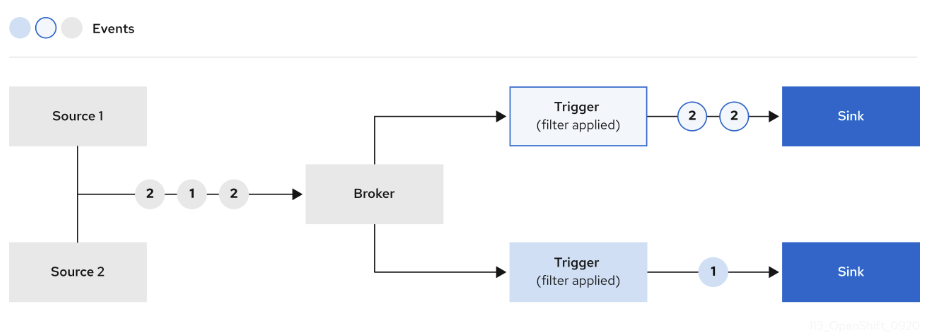
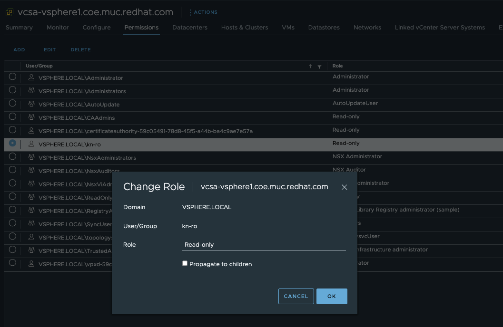

# Red Hat OpenShift Serverless Demo

⚠️ WIP

This repository is intent to provide information on Red Hat's OpenShift Serverless (Knative Serving) capabilities.

Demoing Red Hat's OpenShift Serverless/Knative Eventing power.

## Eventing

Knative Eventing uses standard HTTP POST requests to send and receive events between event producers and sinks. These events conform to the CloudEvents specifications, which enables creating, parsing, sending, and receiving events in any programming language.

### InMemoryChannel Broker

In order to send events from a system (source) to a sink, you need a component which does it for you. This is a [Broker](https://docs.redhat.com/en/documentation/red_hat_openshift_serverless/1.34/html/eventing/brokers#serverless-brokers).



For testing and lab purposes, Knative provides the `InMemoryChannel` broker. Other types of brokers are available too. Like Kafka or RabbitMQ for example. These kind of brokers should be used for production since they are providing e.g. event delivery guarantees.

Creating the `InMemoryChannel` broker:

`kn broker create inmem-broker`

Alternatively:

```shell
oc apply -f - <<EOF
apiVersion: eventing.knative.dev/v1
kind: Broker
metadata:
  name: inmem-broker
  namespace: rguske-kn-eventing
spec:
  config:
    apiVersion: v1
    kind: ConfigMap
    name: config-br-default-channel
    namespace: knative-eventing
  delivery:
    backoffDelay: PT0.2S
    backoffPolicy: exponential
    retry: 10
EOF
```

### Creating the Knative ApiServerSource

The `ApiServerSource` is a `source` which connects to the Kubernetes Api Server (ReadOnly) and receives all created events. These events can then be forwarded to e.g. a (subscribed) `Trigger`. Triggers will be covered below.

Create a service account, role, and role binding for the event source:

```yaml
oc create -f - <<EOF
apiVersion: v1
kind: ServiceAccount
metadata:
  name: events-sa
  namespace: rguske-kn-eventing
---
apiVersion: rbac.authorization.k8s.io/v1
kind: Role
metadata:
  name: event-watcher
  namespace: rguske-kn-eventing
rules:
  - apiGroups:
      - ""
    resources:
      - events
    verbs:
      - get
      - list
      - watch
---
apiVersion: rbac.authorization.k8s.io/v1
kind: RoleBinding
metadata:
  name: k8s-ra-event-watcher
  namespace: rguske-kn-eventing
roleRef:
  apiGroup: rbac.authorization.k8s.io
  kind: Role
  name: event-watcher
subjects:
  - kind: ServiceAccount
    name: events-sa
    namespace: rguske-kn-eventing
EOF
```

Create the ApiServerSource using mode `Resource` via Cli:

> EventMode controls the format of the event. Set to Reference to send a dataref event type for the resource being watched. Only a reference to the resource is included in the event payload. Set to Resource to have the full resource lifecycle event in the payload. Defaults to Reference.

[Source: ApiServerSource reference](https://knative.dev/docs/eventing/sources/apiserversource/reference/#apiserversource)

```shell
kn source apiserver create api-server-source \
--sink broker:inmem-broker \
--resource "event:v1" \
--service-account events-sa \
--mode Resource
```

Alternatively:

```yaml
oc create -f - <<EOF
apiVersion: sources.knative.dev/v1
kind: ApiServerSource
metadata:
  name: api-server-source
  namespace: rguske-kn-eventing
  labels:
    app: api-server-source
spec:
  mode: Resource
  resources:
    - apiVersion: v1
      kind: Event
  serviceAccountName: events-sa
  sink:
    ref:
      apiVersion: eventing.knative.dev/v1
      kind: Broker
      name: inmem-broker
EOF
```

#### Knative ApiServerSource

The following example restricts the `ServiceAccount` the only read the objects `deployments`, `virtualmachines` and `virtualmachineinstances`. Therefore, the object `Role` has two `rules` configured.

```yaml
oc create -f - <<EOF
apiVersion: v1
kind: ServiceAccount
metadata:
  name: events-sa
  namespace: rguske-kn-eventing
---
apiVersion: rbac.authorization.k8s.io/v1
kind: Role
metadata:
  name: event-watcher
  namespace: rguske-kn-eventing
rules:
  - apiGroups:
      - "apps"
    resources:
      - deployments
    verbs:
      - get
      - list
      - watch
  - apiGroups:
      - "kubevirt.io"
    resources:
      - virtualmachines
      - virtualmachineinstances
    verbs:
      - get
      - list
      - watch
---
apiVersion: rbac.authorization.k8s.io/v1
kind: RoleBinding
metadata:
  name: k8s-ra-event-watcher
  namespace: rguske-kn-eventing
roleRef:
  apiGroup: rbac.authorization.k8s.io
  kind: Role
  name: event-watcher
subjects:
  - kind: ServiceAccount
    name: events-sa
    namespace: rguske-kn-eventing
EOF
```

The following `ApiServerSource` example configuration only forwards events which happened to the objects types `Deployment`, `VirtualMachines` and `VirtualMachineInstances`.

```yaml
oc create -f - <<EOF
apiVersion: sources.knative.dev/v1
kind: ApiServerSource
metadata:
  name: api-server-source
  namespace: rguske-kn-eventing
  labels:
    app: api-server-source
spec:
  mode: Resource
  resources:
    - apiVersion: apps/v1
      kind: Deployment
    - apiVersion: kubevirt.io/v1
      kind: VirtualMachine
    - apiVersion: kubevirt.io/v1
      kind: VirtualMachineInstance
      selector:
        matchExpressions:
          - key: eventing
            operator: In
            values:
              - rguske
  serviceAccountName: events-sa
  sink:
    ref:
      apiVersion: eventing.knative.dev/v1
      kind: Broker
      name: inmem-broker
EOF
```

### Event-Display Applications

In order to get all incoming events displayed either on a terminal or in a webbrower, Event Display applications come in handy.

Create a Knative service that dumps incoming messages to its log:

`kn service create event-display --image quay.io/openshift-knative/showcase`

This app can be browsed via its `route`:

```shell
kn route list
NAME            URL                                                                                READY
event-display   https://event-display-rguske-kn-eventing.apps.ocp4.stormshift.coe.muc.redhat.com   True
```

2nd application:

Install [Sockeye](https://github.com/n3wscott/sockeye)

```yaml
oc create -f - <<EOF
apiVersion: serving.knative.dev/v1
kind: Service
metadata:
  name: sockeye
spec:
  template:
    spec:
      containerConcurrency: 0
      containers:
      - image: n3wscott/sockeye:v0.7.0
EOF
```

Incoming events can be observed via `logs` or via browsing the url:

```shell
kn route list
NAME            URL                                                                                READY
event-display   https://event-display-rguske-kn-eventing.apps.ocp4.stormshift.coe.muc.redhat.com   True
sockeye         https://sockeye-rguske-kn-eventing.apps.ocp4.stormshift.coe.muc.redhat.com         True
```

`kn service update --scale 1 sockeye`

### Triggers

After events have entered the broker, they can be filtered by CloudEvent attributes using triggers, and sent as an `HTTP POST` request to an event sink.

Event source --> Broker --> Trigger --> Sink
Kubernetes --> InMemoryChannel Broker --> Trigger --> Sockeye

Create `trigger`s for the two event-display apps:

`kn trigger create trigger-event-display --broker inmem-broker --sink ksvc:event-display`

`kn trigger create trigger-sockeye --broker inmem-broker --sink ksvc:sockeye`

```shell
kn trigger list
NAME                    BROKER         SINK                 AGE   CONDITIONS   READY   REASON
trigger-event-display   inmem-broker   ksvc:event-display   26s   7 OK / 7     True
trigger-sockeye         inmem-broker   ksvc:sockeye         17s   7 OK / 7     True
```

In `yaml`:

```yaml
oc create -f - <<EOF
apiVersion: eventing.knative.dev/v1
kind: Trigger
metadata:
  labels:
    eventing.knative.dev/broker: inmem-broker
  name: trigger-event-display
  namespace: rguske-kn-eventing
spec:
  broker: inmem-broker
  filter: {}
  subscriber:
    ref:
      apiVersion: serving.knative.dev/v1
      kind: Service
      name: event-display
      namespace: rguske-kn-eventing
EOF
```

```yaml
oc create -f - <<EOF
apiVersion: eventing.knative.dev/v1
kind: Trigger
metadata:
  labels:
    eventing.knative.dev/broker: inmem-broker
  name: trigger-sockeye
  namespace: rguske-kn-eventing
spec:
  broker: inmem-broker
  filter: {}
  subscriber:
    ref:
      apiVersion: serving.knative.dev/v1
      kind: Service
      name: sockeye
      namespace: rguske-kn-eventing
EOF
```


```yaml
oc create -f - <<EOF
apiVersion: kubevirt.io/v1
kind: VirtualMachine
metadata:
  annotations:
  labels:
    app: rhel9-pod-bridge
    kubevirt.io/dynamic-credentials-support: "true"
  name: rhel9-pod-bridge
spec:
  dataVolumeTemplates:
    - apiVersion: cdi.kubevirt.io/v1beta1
      kind: DataVolume
      metadata:
        name: rhel9-pod-bridge
      spec:
        sourceRef:
          kind: DataSource
          name: rhel9
          namespace: openshift-virtualization-os-images
        storage:
          accessModes:
            - ReadWriteMany
          storageClassName: thin-csi
          resources:
            requests:
              storage: 30Gi
  running: false
  template:
    metadata:
      annotations:
        vm.kubevirt.io/flavor: tiny
        vm.kubevirt.io/os: rhel9
        vm.kubevirt.io/workload: server
        kubevirt.io/allow-pod-bridge-network-live-migration: ""
      labels:
        kubevirt.io/domain: rhel9-pod-bridge
        kubevirt.io/size: tiny
    spec:
      domain:
        cpu:
          cores: 1
          sockets: 1
          threads: 1
        devices:
          disks:
            - disk:
                bus: virtio
              name: rootdisk
            - disk:
                bus: virtio
              name: cloudinitdisk
          interfaces:
            - bridge: {}
              name: default
        machine:
          type: pc-q35-rhel9.2.0
        memory:
          guest: 1.5Gi
      networks:
        - name: default
          pod: {}
      terminationGracePeriodSeconds: 180
      volumes:
        - dataVolume:
            name: rhel9-pod-bridge
          name: rootdisk
        - cloudInitNoCloud:
            userData: |-
              #cloud-config
              user: cloud-user
              password: redhat
              chpasswd: { expire: False }
          name: cloudinitdisk
EOF
```

## Tanzu Sources for Knative

Available `Sources` and `Bindungs`

* `VSphereSource` to create VMware vSphere (vCenter) event sources
* `VSphereBinding` to inject VMware vSphere (vCenter) credentials
* `HorizonSource` to create VMware Horizon event sources

### vSphere Preperations

Create a dedicated user in vSphere which will be used to establish a connection from the Knative `VsphereSource` to the vCenter Server. I named my user `kn-ro`. At the vCenter level, add the user and assign the `Read-only` role.



### Download `kn-vsphere`

Repository on Github [VMware Tanzu Sources for Knative](https://github.com/vmware-tanzu/sources-for-knative)

Downloading the `kn-vsphere` plugin for the `kn` cli.

`curl -LO https://github.com/vmware-tanzu/sources-for-knative/releases/download/v0.39.0/kn-vsphere_Linux_x86_64.tar.gz`

Unpack and copy the binary into your $PATH.

```code
kn vsphere
Knative plugin to create Knative compatible Event Sources for VMware vSphere events,
and Bindings to access the vSphere API

Usage:
  kn-vsphere [command]

Available Commands:
  auth        Manage vSphere credentials
  binding     Manage vSphere API bindings
  completion  Generate the autocompletion script for the specified shell
  help        Help about any command
  source      Manage vSphere Event Sources
  version     Prints the plugin version

Flags:
  -h, --help   help for kn-vsphere

Use "kn-vsphere [command] --help" for more information about a command
```

### Install the Source

The CRs for the `Sources` can be installed e.g. via `kubectl apply -f https://github.com/vmware-tanzu/sources-for-knative/releases/latest/download/release.yaml`

Output:

```code
kubectl apply -f https://github.com/vmware-tanzu/sources-for-knative/releases/latest/download/release.yaml
namespace/vmware-sources created
serviceaccount/horizon-source-controller created
serviceaccount/horizon-source-webhook created
clusterrole.rbac.authorization.k8s.io/vsphere-receive-adapter-cm created
clusterrole.rbac.authorization.k8s.io/vmware-sources-admin created
clusterrole.rbac.authorization.k8s.io/vmware-sources-core created
clusterrole.rbac.authorization.k8s.io/podspecable-binding configured
clusterrole.rbac.authorization.k8s.io/builtin-podspecable-binding configured
serviceaccount/vsphere-controller created
clusterrole.rbac.authorization.k8s.io/horizon-source-controller created
clusterrole.rbac.authorization.k8s.io/horizon-source-observer created
clusterrolebinding.rbac.authorization.k8s.io/vmware-sources-controller-admin created
clusterrolebinding.rbac.authorization.k8s.io/vmware-sources-webhook-podspecable-binding created
clusterrolebinding.rbac.authorization.k8s.io/vmware-sources-webhook-addressable-resolver-binding created
clusterrolebinding.rbac.authorization.k8s.io/horizon-source-controller-rolebinding created
clusterrolebinding.rbac.authorization.k8s.io/horizon-source-webhook-rolebinding created
clusterrolebinding.rbac.authorization.k8s.io/horizon-source-controller-addressable-resolver created
clusterrole.rbac.authorization.k8s.io/horizon-source-webhook created
customresourcedefinition.apiextensions.k8s.io/horizonsources.sources.tanzu.vmware.com created
customresourcedefinition.apiextensions.k8s.io/vspherebindings.sources.tanzu.vmware.com created
customresourcedefinition.apiextensions.k8s.io/vspheresources.sources.tanzu.vmware.com created
service/horizon-source-controller-manager created
service/horizon-source-webhook created
service/vsphere-source-webhook created
deployment.apps/horizon-source-controller created
mutatingwebhookconfiguration.admissionregistration.k8s.io/defaulting.webhook.horizon.sources.tanzu.vmware.com created
validatingwebhookconfiguration.admissionregistration.k8s.io/validation.webhook.horizon.sources.tanzu.vmware.com created
validatingwebhookconfiguration.admissionregistration.k8s.io/config.webhook.horizon.sources.tanzu.vmware.com created
secret/webhook-certs created
deployment.apps/horizon-source-webhook created
mutatingwebhookconfiguration.admissionregistration.k8s.io/defaulting.webhook.vsphere.sources.tanzu.vmware.com created
validatingwebhookconfiguration.admissionregistration.k8s.io/validation.webhook.vsphere.sources.tanzu.vmware.com created
validatingwebhookconfiguration.admissionregistration.k8s.io/config.webhook.vsphere.sources.tanzu.vmware.com created
secret/vsphere-webhook-certs created
mutatingwebhookconfiguration.admissionregistration.k8s.io/vspherebindings.webhook.vsphere.sources.tanzu.vmware.com created
deployment.apps/vsphere-source-webhook created
configmap/config-leader-election created
configmap/config-logging created
configmap/config-observability created
```

export VCENTER_HOSTNAME='vcsa-vsphere1.coe.muc.redhat.com' \
export VCENTER_USERNAME='kn-ro@vsphere.local' \
export VCENTER_PASSWORD='R3dh4t1!'

```code
kn vsphere auth create \
--namespace rguske-tanzu-sources \
--username '$VCENTER_USERNAME' \
--password '$VCENTER_PASSWORD' \
--name vcsa-ro-creds \
--verify-url https://$VCENTER_HOSTNAME \
--verify-insecure
```

```shell
oc create -f - <<EOF
apiVersion: eventing.knative.dev/v1
kind: Broker
metadata:
  name: inmem-broker-vsphere
  namespace: rguske-tanzu-sources
spec:
  config:
    apiVersion: v1
    kind: ConfigMap
    name: config-br-default-channel
    namespace: knative-eventing
  delivery:
    backoffDelay: PT0.2S
    backoffPolicy: exponential
    retry: 10
EOF
```

```code
kn vsphere source create \
--namespace rguske-tanzu-sources \
--name vcsa-source \
--vc-address https://vcsa-vsphere1.coe.muc.redhat.com \
--skip-tls-verify \
--secret-ref vcsa-ro-creds \
--sink-uri http://broker-ingress.knative-eventing.svc.cluster.local/rguske-tanzu-sources/inmem-broker-vsphere \
--encoding json
```

Install [Sockeye](https://github.com/n3wscott/sockeye)

```yaml
oc create -f - <<EOF
apiVersion: serving.knative.dev/v1
kind: Service
metadata:
  name: sockeye-vsphere
spec:
  template:
    spec:
      containerConcurrency: 0
      containers:
      - image: n3wscott/sockeye:v0.7.0
EOF
```

Incoming events can be observed via `logs` or via browsing the url:

```shell

```

`kn service update --scale 1 sockeye-vsphere`

### Triggers

`kn trigger create trigger-sockeye-vsphere --broker inmem-broker-vsphere --sink ksvc:sockeye-vsphere`